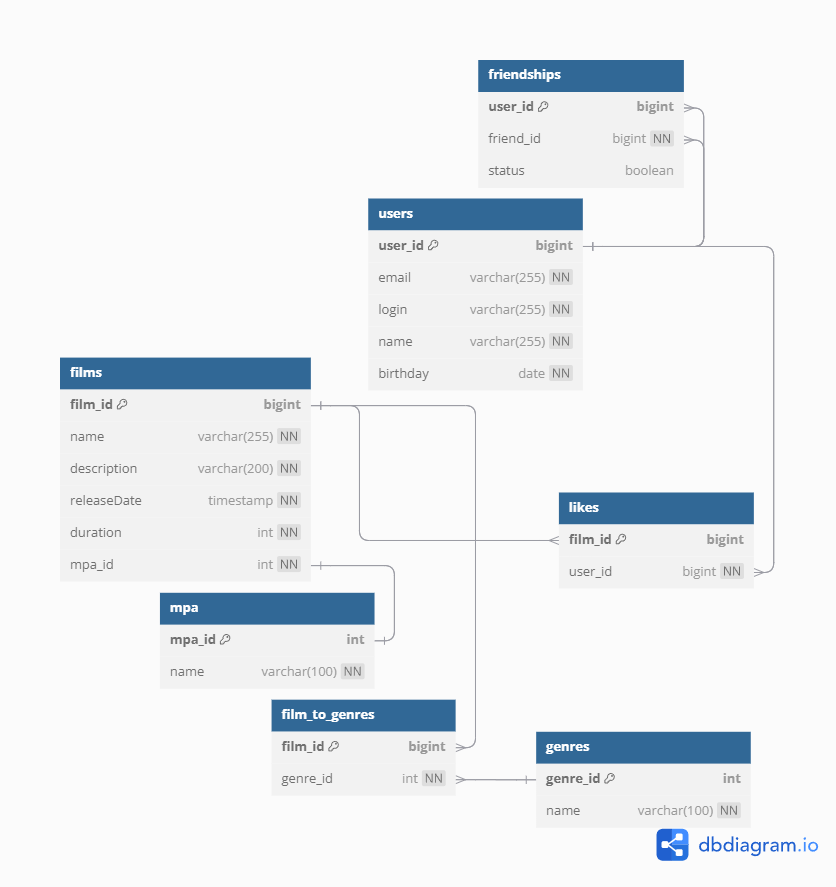

# java-filmorate
Template repository for Filmorate project.

### Схема СУБД
<picture>
    <source media="(prefers-color-scheme: dark)" srcset="src/main/resources/model_db.png">
    
</picture>

### Код из dbdiagram.io
```
Ccskrf ( https://dbdiagram.io/d/66ec7a68a0828f8aa66d7911 )

table users {
user_id bigint [pk, increment]
email varchar(255) [not null]
login varchar(255) [not null]
name varchar(255) [not null]
birthday date [not null]

}

table films {
film_id bigint [pk, increment]
name varchar(255) [not null]
description varchar(200) [not null]
releaseDate timestamp [not null]
duration int [not null]
mpa_id int [not null, note: 'fk', ref: - mpa.mpa_id]
}

table film_to_genres {
film_id bigint [pk, increment, note: 'fk', ref: > films.film_id]
genre_id int [not null, note: 'fk', ref: > genres.genre_id]


}


table genres {
genre_id int [pk, increment]
name varchar(100) [not null]
}

table mpa {
mpa_id int [pk, increment]
name varchar(100) [not null]
}

table likes {
film_id bigint [pk, increment, note: 'fk', ref: > films.film_id]
user_id bigint [not null, note: 'fk', ref: > users.user_id]

}

table friendships {
user_id bigint [pk, increment,note: 'fk', ref: > users.user_id]
friend_id bigint [not null, note: 'fk', ref: > users.user_id]
status boolean
}
```